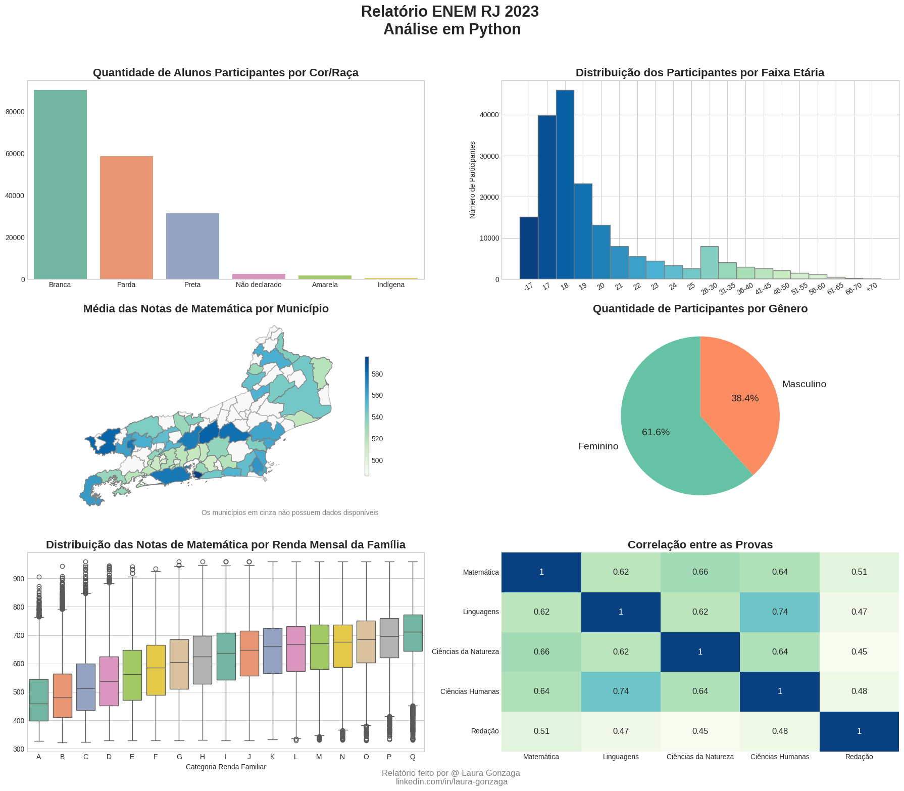

# 📈 Análise Exploratória dos Microdados do ENEM 2023 (RJ)

Este projeto realiza uma análise exploratória dos microdados do ENEM 2023, focando nos participantes do estado do Rio de Janeiro. A análise abrange limpeza e tratamento de dados, além de diversas visualizações para entender melhor o perfil dos inscritos e seus desempenhos.

---

### 📊 Fonte dos Dados  
Os microdados utilizados nesta análise foram extraídos do conjunto de dados oficial do ENEM 2023, disponibilizado pelo INEP. Você pode acessá-los diretamente no portal do governo:  
🔗 [Microdados ENEM 2023 - INEP](https://www.gov.br/inep/pt-br/acesso-a-informacao/dados-abertos/microdados/enem)  

---

### 🖼️ Relatório Visual  
Abaixo está um resumo gráfico de algumas das análises realizadas:  

---

### 🔍 Principais Análises Realizadas  

✔️ Distribuição de inscritos por gênero, faixa etária e tipo de escola.  
✔️ Comparação do desempenho entre diferentes grupos (gênero, raça, escola, renda familiar).  
✔️ Identificação de padrões de correlação entre as notas das provas.  
✔️ Visualização geoespacial das notas médias por município.  
✔️ Perfil dos "treineiros" (alunos que fazem a prova como teste).  

---

### 💡 Principais Insights  

A análise é limitada a dados de um único ano e região, portanto, não podemos generalizar resultados sem considerar os microdados de outros anos. Contudo, com base na análise realizada, observamos os seguintes pontos:  

📌 **Maior participação feminina:** As mulheres tiveram maior participação na prova do ENEM de 2023 no estado do Rio de Janeiro.  

📌 **Desempenho das mulheres:** Embora as mulheres tenham se destacado na quantidade de participantes, as suas notas foram, em média, inferiores às dos homens nas provas de múltipla escolha, especialmente em Matemática. No entanto, na prova de Redação, as mulheres apresentaram notas melhores.  

📌 **Desigualdade no desempenho por raça:** A maioria dos candidatos se autodeclara branca, e esse grupo obteve, em média, notas mais altas do que candidatos pretos e pardos.  

📌 **Perfil dos treineiros:** A grande maioria dos treineiros (alunos realizando a prova para praticar seus conhecimentos) possui menos de 18 anos e todos estão cursando Ensino Médio com previsão de conclusão após 2023. 

📌 **Correlação entre provas:** A maior correlação de desempenho foi observada entre as provas de Ciências Humanas e Linguagens. Alunos que se saem bem em uma dessas provas tendem a ter bom desempenho na outra. Por outro lado, a prova de Redação apresenta a menor correlação com as demais.  

📌 **Desempenho por tipo de escola e renda:** Os alunos de escolas privadas tendem a obter melhores resultados em todas as provas do que os de escolas públicas. Além disso, a nota média aumenta com a elevação da renda familiar.  

📌 **Municípios com melhor desempenho:** Os municípios com as melhores médias totais foram **Niterói, Nova Friburgo, Teresópolis, Volta Redonda e Resende**. A capital ocupa a sétima posição.  

---

### 🏷 Autor  

👤  **Laura Gonzaga**  
📎 [LinkedIn](https://linkedin.com/in/laura-gonzaga)  
